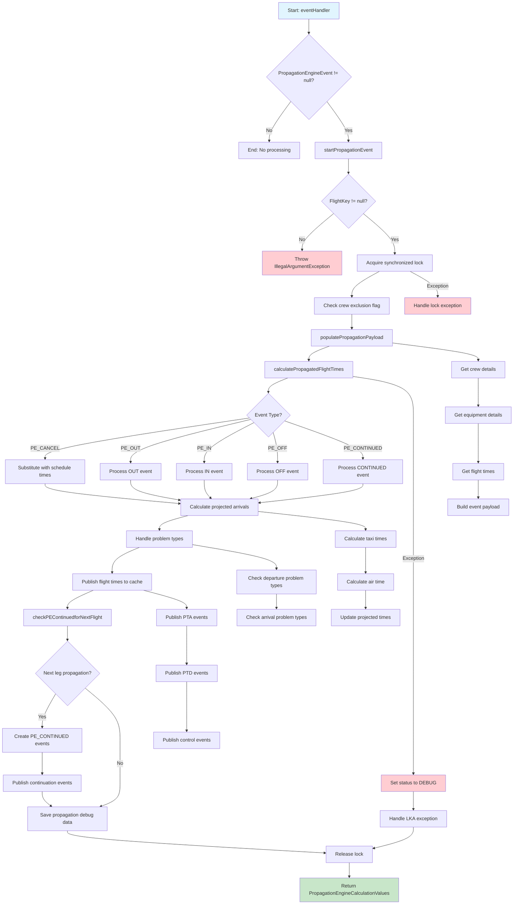

# Flight Propagation Engine Flowchart

This document contains the flowchart for the Flight Propagation Engine event handler process.

## Main Flowchart

## Flow Description

This flowchart illustrates the complete process flow for the Flight Propagation Engine event handler, including:

- **Event validation**: Checks for valid PropagationEngineEvent and FlightKey
- **Lock management**: Acquires and releases synchronized locks for thread safety
- **Event processing**: Handles different event types (PE_CANCEL, PE_OUT, PE_IN, PE_OFF, PE_CONTINUED)
- **Time calculations**: Calculates projected flight times and arrivals
- **Problem handling**: Manages various problem types and exceptions
- **Cache publishing**: Publishes flight times and events to cache
- **Continuation logic**: Handles next leg propagation when applicable

The flowchart uses color coding:
- **Blue**: Start node
- **Green**: Successful end node
- **Red**: Error/exception nodes
